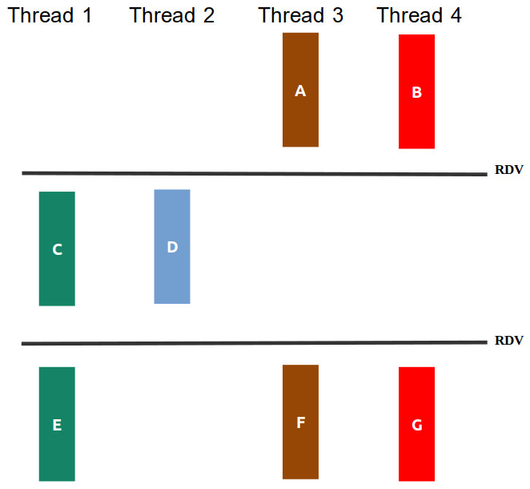

<!-- markdown_py README.md > README.html -->
<!-- pandoc README.md -f markdown -t html -s -o README.html --metadata title="AF SisHard 25-2" -->

# Avaliação Final de Sistemas Hardware-Software

Neste prova iremos avaliar os objetivos de aprendizagem trabalhados na segunda metade do curso. Cada pasta contém os arquivos de uma questão da prova, incluindo arquivos `.c` para vocês colocarem suas soluções.

## Regras da prova

1. É permitido consultar o material da disciplina durante a prova (repositório da disciplina e seu repositório de atividades), além de seus materiais físicos, a calculadora nativa do Ubuntu e os links de sites presentes nas aulas, veja a página de dicas da disciplina. **Ficam proibidas consultas a materiais de outros alunos ou qualquer forma de IA (sujeito a código de ética).**

1. Durante a prova não é permitido consultar outras pessoas, sejam do Insper ou não. Não abra E-mail, Whatsapp, Discord, etc.

1. A chamada na prova será realizada pela assinatura na lista de prensença. Não saia sem assinar a lista.

1. Não serão tiradas dúvidas do conteúdo da disciplina durante a prova.

1. A entrega da sua prova deverá ser feita via Blackboard. **Não serão aceitas entregas por outros meios**.

1. As questões da prova **serão avaliadas por um corretor automático**, um executável disponível na pasta de cada questão (`./teste`). Esse executável corrige a resposta utilizando uma rubrica incremental, na qual as funcionalidades devem ser implementadas em sequência. Para que uma funcionalidade seja validada, é necessário que todas as anteriores também tenham sido concluídas corretamente. Quanto maior o número de funcionalidades atendidas, maior será a nota.

1. **IMPORTANTE**: nessa disciplina fica proibido o uso de de ferramentes de auxílio para geração de código (IA) **copilot (se tiver instalado desinstale)** e o uso de ferramentas de **geração de código automático por IA** (por exemplo:**ChatGPT**), pois é esperado que atividade intelectual seja realizada exclusivamente pelo o aluno, o não atendimento dessa restrição implica em **nota 0,0** e código de ética. 
 

## Antes de começar a resolver

- Faça o download do arquivo *zip* da pasta e descompacte em alguma pasta no seu computador, não é necessário salvar os arquivos no seu repositório. Ao final **rezip** a pasta inteira e **faça upload no Blackboard**.

- Caso atenda todas as rubricas da questão, o executável de teste  (`./teste`), terá com saída um **PASS** com a nota da questão, que significa que o programa de teste não encontrou problemas em sua solução (não que ela esteja correta!), depois da entrega será feito uma validação extra pelo professor, envolvendo por exemplo:

    - Verificar o uso de funções não permitidas, que poderá resultar na anulação da nota no exercício.
    
    - Os testes pegam apenas alguns casos, garanta que sua solução funciona conforme o requisitado no enunciado.
    
    - Se passou nos testes mas a solução está errado, a nota será desconsiderada.
    
    - **Tentativas de burlar os testes resultarão em zero na prova**.
    
---

## Questão 1 (2,5)
<style scoped>section { font-size: 20px; }</style>

A figura *q1/sincronizacao.png* ilustra as relações de dependência entre as partes das funções `thread1, thread2, thread3` e `thread4`, mostrando que algumas delas poderiam ser feitas de maneira concorrente.




Seu trabalho nesta questão será:

1. criar threads para **execução concorrente** dos prints das funções. (**40% da nota**).

1. **usar semáforos** para que a **ordem e concorrência** dos prints das partes das tarefas respeitem o diagrama da figura. (**60% da nota**).


**OBS**:

- Você não deve introduzir novas dependências ou travar a saída com semafóros de forma que seu programa tenha uma única saída; o seu programa deve permitir impressões concorrentes, por exemplo, para figura *q1/sincronizacao.png* são possíveis, entre outras, as saídas: `ABCDEFG`, `BACDEFG`, `ABDCEFG`, `BADCGFE`, `BADCGFE`..... 

- Não altere os `printf` existentes, nem adicione novos.

- A nota da questão virá pelos testes automáticos e a análise visual pelo professor será apenas para confirmar que nenhuma regra foi quebrada!

- **Importante: Caso use variáveis globais na solução da questão a nota será zero (mesmo que passe nos testes).**


**Como descrubro minha nota?**:

Execute o corretor automático do exercício.

```
./teste
```

---

## Questão 2 (2,5)

Nessa questão desenvolva o programa `q2.c` que encontra o **maior** elemento no vetor `A[]` de inteiros com `n` posições. 

O seu programa deve criar `K` processos filhos sendo, cada um deles, responsável por procurar em uma região `R` do vetor.

O **maior** elemento encontrado pelo processo filho na sua região `R` deve ser devolvido (retornado) ao processo pai, que consolida o resultado comparando os maiores elementos retornados por todos os processos filhos; ao final, processo pai imprime a **ordem do processo** (`P0`, `P1`, `P2`, ... ) que encontrou o maior elemento e o maior elemento no vetor `A[]`. Caso mais de um filho tenha encontrado o **maior** o processo pai escolhe o **filho de ordem menor**. 

Por exemplo considere o arquivo de entrada `in4.txt`.


```

2 
4 
38
10
4
3

```

A primeira linha do arquivo informa a quantidade de processos filhos que serão criados `K`e a segunda linha a quantidade de números no arquivo `N`, assim cada processo deverá trabalhar em uma região `R` de tamanho `2` (porque `N/K = 4/2 = 2`).

Para a entrada acima o processo pai deve mostrar a mensagem **`P0 maior=38`** informando que o maior elemento no vetor é número `38` e foi encontrado pelo processo de ordem `0`. Na pasta da questão `./q2` colocamos alguns arquivos de testes, mas você pode criar os seus, para validar a solução.

Seu trabalho nesta questão será:

1. criar `K` processos filhos para executar a busca do maior elemento no vetor `A[]` em paralelo. Os **processos filhos devem esperar `5` segundos** antes de iniciar a busca (apenas os filhos esperam, o **pai não!**). (**40% da nota**)

2. Processo pai imprime corretamente a ordem do processo que encontrou e o maior valor, com a mensagem `"P%d maior=%d\n"`, substituindo o primeiro `%d` pela ordem do filho e o segundo `%d` pelo maior elemento no vetor. (**40% da nota**)

3. Programa passa no *valgrind* sem erros. Aqui, também será necessário liberar memórias alocadas na main no código que recebeu pronto! (**20% da nota** apenas se resolveu corretamente os anteriores).

Para compilar o seu programa use:

```
gcc q2.c -o q2
```

Exemplo de como seu programa `q2` será chamado:

```
./q2 < in4.txt
```

Para testar usando *valgrind* use:

```
valgrind --leak-check=yes ./q2 < in4.txt
```


**Restrições**: 

- Os valores no vetor `A[]` estarão sempre entre `0` até `255`

- Considere que `N % K = 0`;

- **Importante**: o seu programa principal (pai) deve obrigatoriamente finalizar retornando 0 (`return 0`).

**Como descrubro minha nota?**:

Execute o corretor automático do exercício.

```
./teste
```

---

## Questão 3 (2,5)

Abra o arquivo `q3.c`!

Uma nova funcionalidade foi requisitada nesta aplicação e você é o responsável por implementá-la: gerar log de inicialização e finalização do programa, de modo que quando o usuário desejar fechar a aplicação, isto seja registrado em um arquivo de texto.

Sua tarefa neste exercício é:

1. Ao inicializar a aplicação com `./q3 logfile.txt`, adicionar ao arquivo de log `logfile.txt` uma nova linha contendo uma mensagem conforme o exemplo `./q3 iniciado\n`. Se o arquivo de log não existir, deve ser criado (**20% da nota**).

2. Se ao inicializar a aplicação e o arquivo de log já existir, ele não deve ser sobrescrito, as mensagens de log são escritas no final arquivo (**10% da nota**). **DICA**: veja os flags da função `open()` em `man 2 open`.

3. Ao receber um sinal **SIGTERM** (15), adicionar ao arquivo de log uma nova linha contendo uma mensagem conforme o exemplo `./q3 finalizado\n` e a aplicação é finalizada. (**30% da nota pelo registro do handler e pela mensagem no arquivo**).

4. Ao receber um sinal **SIGINT** (2), adicionar ao arquivo de log uma nova linha contendo uma mensagem conforme o exemplo `./q3 nao finalizado com SIGINT\n`, nesse caso a aplicação não é finalizada. (**20% da nota pelo registro do handler e pela mensagem na saída padrão**)

5. O programa sai com o mesmo sinal que recebeu. (**20% da nota**)

**OBS**:

- Você deve criar as funções para serem handlers dos sinais

- Os Handlers devem ser registrados na `main`

- Perceba que o nome do arquivo de log é passado pela linha de comando, nem sempre será `logfile.txt`.

- Para manipular o arquivo de log, utilize APENAS as chamadas do padrão POSIX conforme apresentado em aula: `open`, `close`, `read`, `write`. Não pode utilizar `fopen`, `fdopen`,`fgets`, `fscanf` por exemplo. 


Para testar sua implementação você pode compilar o seu programa com:

```
gcc q3.c  -g -o q3
```

E envie sinais pelo terminal e confira o arquivo de log gerado!

```
kill -<codigo do sinal> <pid do processo>
```

**Como descrubro minha nota?**:

Execute o corretor automático do exercício.

```
./teste
```

---

## Questão 4 (2,5)
Nos labs `02` e `03`desse semestre vimos o quão necessário é saber manipular **strings** e **arquivos** na linguagem **C**.

Nesta questão o seu trabalho será escrever um programa que recebe o nome de dois arquivos por linha de comando; os arquivos contêm palavras separadas por `\n`, a exceção é a última linha que não tem `\n`, em seguida seu programa deve intercalar o conteúdo dos arquivos no arquivo **`q4_saida.txt`**. 

Para a chamada do programa:

```
./q4 caso1.txt caso2.txt
```

Teríamos a seguinte saída no arquivo `q4_saida.txt`. 

| caso1.txt | caso2.txt | q4_saida.txt |
| ---       | ---       | ---          |
| carlos    | caju      | carlos       |
| ana       | uva       | caju         |
|           | pera      | ana          |
|           | caqui     | uva          |
|           |           | pera         |
|           |           | caqui        |

Note que o processo de intercalação das palavras lidas começa com a palavra lida do 1<sup>o</sup> arquivo e caso um dos arquivos termine primeiro, o programa copia as palavras restantes do outro arquivo para o arquivo de saída. Na pasta da questão `./q4` colocamos alguns arquivos de testes, mas você pode criar os seus, para validar a solução.

**IMPORTANTE**: a **última linha** do arquivo de saída também **não possui `\n`** e sempre teremos pelo menos uma palavra nos arquivos de entrada. 

A sua tarefa nessa questão está dividida em três partes:

1. A primeira é programar a função `char *le_palavra(int fd)` que retorna uma string contendo uma palavra lido do arquivo texto apontado por `fd`, caso o arquivo tenha chegado ao fim a função dever retornar `NULL`. Considere que a função já recebe o arquivo que já foi aberto no `main()`, e é obrigatório utilizar apenas a chamada da função`read` para ler os caracteres do arquivo, ou seja, não permito usar a função *getline* por exemplo **(30% da nota)**.

2. Utilizando a função `char *le_palavra(int fd)` o programa gera o arquivo `q4_saida.txt` contendo as linhas dos arquivos de entrada intercaladas. (**50% da nota**)

3.  Programa passa no *valgrind* sem erros. (**20% da nota**, apenas se resolveu corretamente os itens anteriores).

Para compilar:

```
gcc q4.c -o q4
```


Para testar usando *valgrind* use:

```
valgrind --leak-check=yes ./q4 caso1.txt caso2.txt
```


**OBS**:

- Para manipular o arquivo de log, utilize APENAS as chamadas do padrão POSIX conforme apresentado em aula: `open`, `close`, `read`, `write`. Não pode utilizar `fopen`, `fdopen`,`fgets`, `fscanf` por exemplo. Se utilizar, a nota do exexcício será zero (mesmo que passe nos testes).

- Precisa funcionar para qualquer código fonte, se tiver testes fixos apenas para burlar os testes, irá zerar!

- A nota da questão virá pelos testes automáticos e _valgrind_. A análise visual pelo professor para verificar se a função `char *le_palavra(int fd)`  foi implementada conforme especificação e validar se nenhuma regra foi quebrada!

**Como descrubro minha nota?**:

Execute o programa abaixo para testar sua solução

```
./teste
```
---
